## Pull the docker image from DuckerHub and create terminal program. Push to my own DockerHub
1. Hadoop NameNode (https://hub.docker.com/repository/docker/michaelwangtw/hadoop-namenode)
>ref: bde2020/hadoop-namenode
2. Hadoop DataNode (https://hub.docker.com/repository/docker/michaelwangtw/hadoop-datanode)
>ref: bde2020/hadoop-datanode
3. Apache Spark (https://hub.docker.com/repository/docker/michaelwangtw/spark)
>ref: bitnami/spark
4. Jupyter NoteBook (https://hub.docker.com/repository/docker/michaelwangtw/jupyter-notebook)
>ref: jupyter/base-notebook
5. SonarQube and SonarScanner (https://hub.docker.com/repository/docker/michaelwangtw/sonarqube-scanner)

## Instructions to run this ToolBox Application on GCP

### GCP configuration and Required file
1. Download this repositories from Github to your local machine. Navigate to directory ``14848-Cloud-Infrastructure-Design-Analysis-and-Implementation/Course Project``. This directory contain terminal application and YAML template.

2. Create new project on GCP, note down the project ID (mini-project-submit)

3. Go to Cloud Storage and upload yaml template folder ``yaml_template``. This folder contains the yaml file for image deploy and Load Balancer. There should be two subfolder ``service_config`` and ``terminal_config``.

4. Create New Kubernetes Cluster. Navigate to Kubernetes Engine and create new standord cluster. 

5. Wait until Kubernetes engine finished. Connect to Kubernetes cluster in cloud shell.

6. In cloud shell, run ``gsutil ls`` to get the address of yaml template. Run ``gsutil cp -r {YAML template Address}`` to copy `` yaml_template`` folder to Kubernetes cluster.

## Deploy Service on GCP Kubernetes engine
1. In the cloud shell of the Kubernetes cluster we created, navigate to directory ``service_config``
  > The ``service_config`` folder contain the deploymeny YAML and Load Balancer Service YAML for Hadoop-datanode,Hadoop-namenode,Spark,Sonarqube,Jupyter Notebook.
  
2. Run ``kubectl apply -f .`` and all image should deploy and create load balancer for each service.
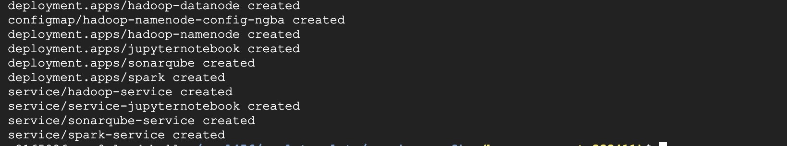

3. Go back to Kubernetes Engine terminal and check if all load balancer has end point.
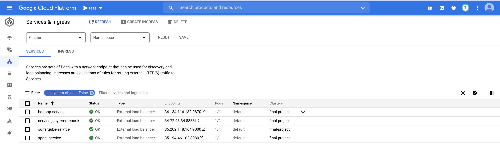

4. Click the endpoint for each service
  > Hadoop-namenode
  > 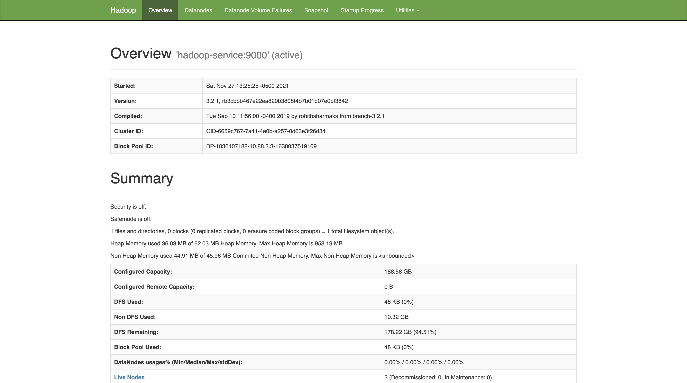
  > Hadoop-datanode
  > 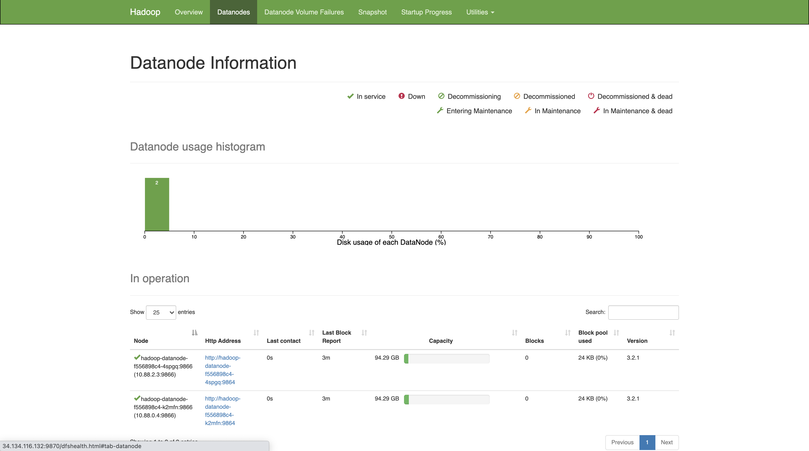

  > Spark
  > 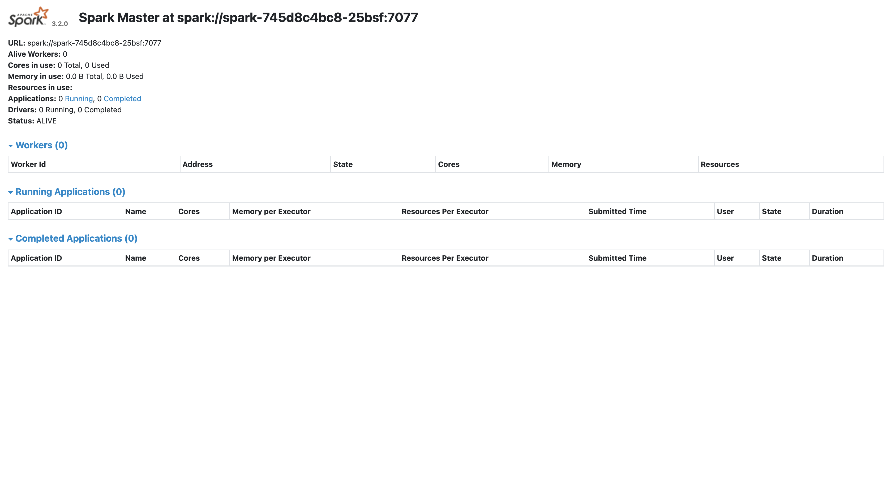

  > Jupyter Notebook
  > 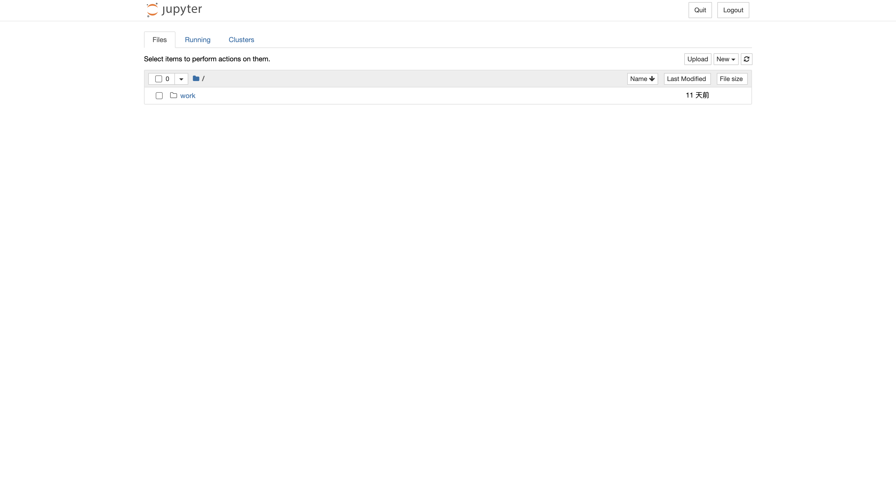

  > Sonar Qubue
  > 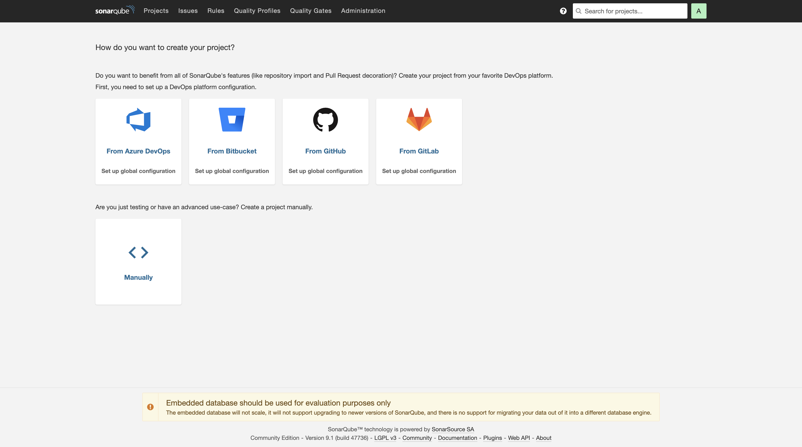

Next we are going to deploy our terminal using these endpoint

## Deploy Terminal on GCP Kubernetes engine
1. On your local machine, go back to the directory ``14848-Cloud-Infrastructure-Design-Analysis-and-Implementation/Course Project``. Navigate to ``terminal`` folder. This folder contains the terminal application.

2. Navigate to ``terminal/app/templates/index.html``. Copy each service's enpoint on GCP to ``index.html``.
   For example: The endpoint for Hadoop service is 104.154.66.84:9870. Copy this address to "Your_Hadoop_EndPoint"
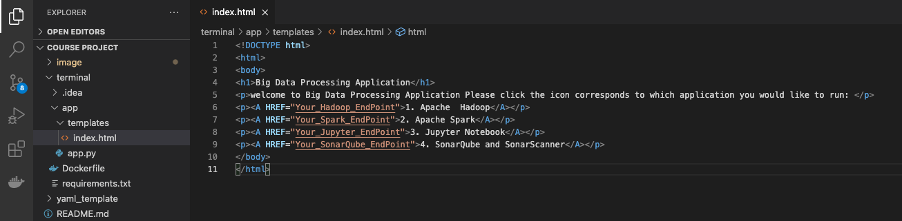
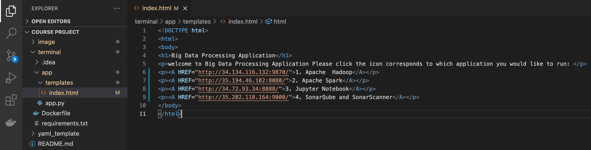

We have finished add service endpoint to the terminal. The user are able to visit different service via terminal.

3. To deploy on GKE, we need to build docker image for terminal application. 

4. In your local machine terminal, navigate to ``14848-Cloud-Infrastructure-Design-Analysis-and-Implementation/Course Project/terminal``

5. Execute ``docker build -t $DOCKER_USER_ID/terminal .``
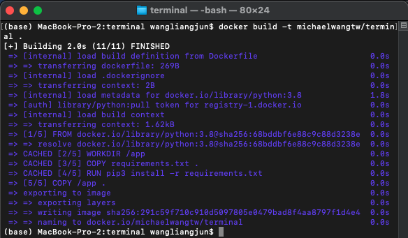

6. Run ``docker push $DOCKER_USER_ID/terminal `` to your docker hub

7. Go back to your GKE cluster. In the cloud shell navigate to ``yaml_template/terminal_config``

8. The folder contains two YAML file. One deploy terminal docker image and one create load balancer. Before apply YAML file, go to ``deployment-terminal.yaml`` and change the terminal docker image path to your own docker image path.

9. Execute ``kubectl apply -f .`` under ``yaml_template/terminal_config``
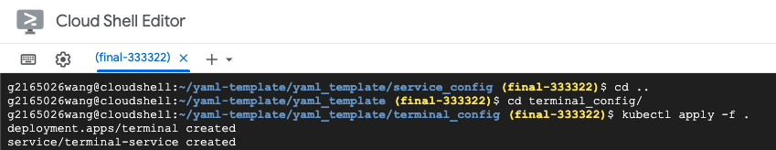

10. Go back to GKE cluster, you should get the endpoint for terminal application. Click the endpoint and navigate to the service you want.

